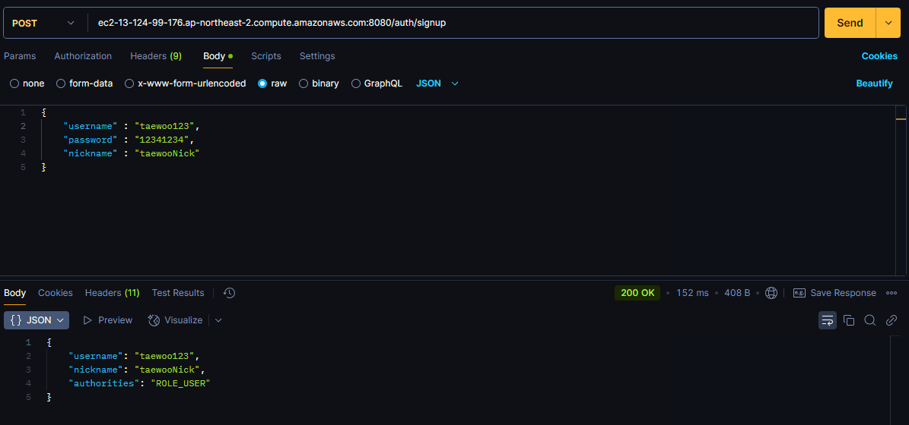
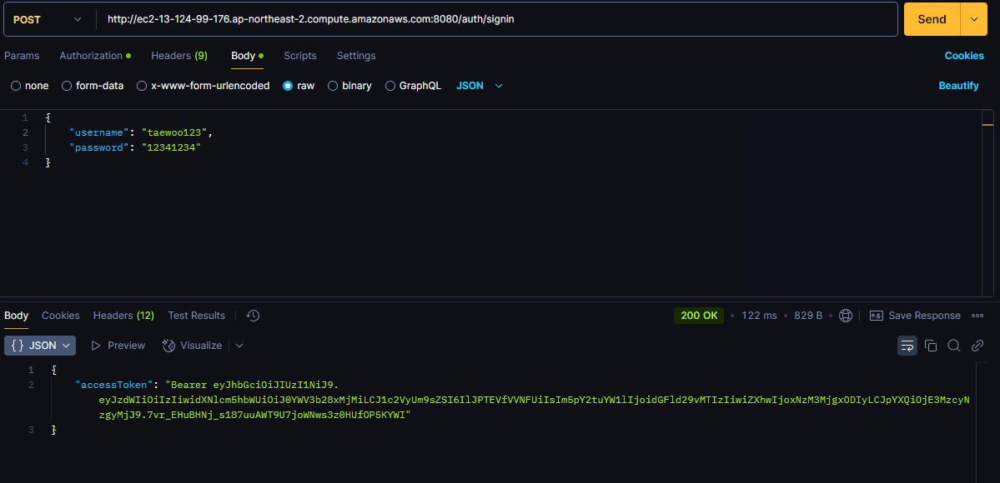

# Java_Onboarding_assignment

##                          * 요구사항 리스트

- [x] Junit 을 이용한 테스트 및 SpringBootTest 를 이용한 통합 테스트
- [x] Spring Security 를 이용한 Filter 에 대한 이해
- [x] JWT와 구체적인 알고리즘의 이해 (Refresh 토큰은 구현하지 못함)
- [x] PR 날려보기
- [x] EC2 에 배포해보기

---

## 배포 사이트

http://ec2-13-124-99-176.ap-northeast-2.compute.amazonaws.com:8080

### 프로젝트 설명

```
도커에 mysql 과 Spring boot build 파일을 컨테이너화 하여 배포하였습니다.
Spring Security 와 Filter 를 이용하여 인증/인가를 구현하였으며
JwtUtil 클래스를 활용하여 사용자가 회원 가입하고 로그인 시도 시 적절한 access Token 을 발급하도록 하였습니다.
```

---

## 요청 & 응답 예시

### 1. 회원 가입

- `URI` : http://ec2-13-124-99-176.ap-northeast-2.compute.amazonaws.com:8080/auth/signup



### 2. 로그인

- `URI` : http://ec2-13-124-99-176.ap-northeast-2.compute.amazonaws.com:8080/auth/signin


